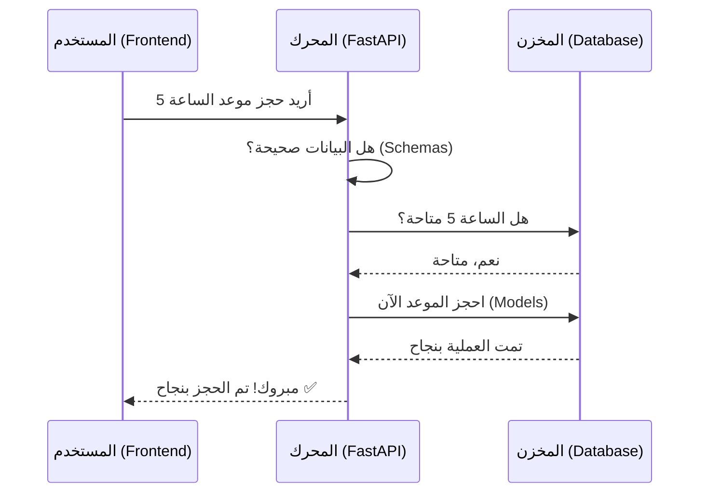
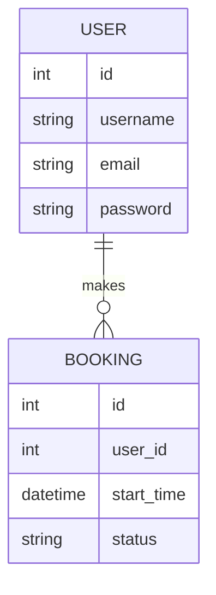

# 🛠️ دليل شرح الـ Backend لمشروع Elwakel-Sport (للمبتدئين)

أهلاً بك! في هذا الدليل، سنقوم برحلة داخل "عقل" الموقع، وهو الجزء الذي لا يراه المستخدم ولكن بدونه لا يعمل الموقع. سنشرح كل شيء ببساطة شديدة وكأننا نشرح لصديق.

---

## 1. ما هو الـ Backend؟ 🤔
تخيل أن الموقع هو **مطعم**:
*   **الواجهة (Frontend):** هي صالة الطعام، الديكور، والقائمة الجميلة التي تراها.
*   **الخلفية (Backend):** هي **المطبخ**. هنا يتم تجهيز الطعام (البيانات)، التأكد من وجود المكونات (قاعدة البيانات)، والتأكد من أن من طلب الطعام هو شخص مسجل لدينا (الحماية).
    
في مشروعنا، استخدمنا تقنية تسمى **FastAPI**، وهي تقنية حديثة وسريعة جداً مبنية بلغة **Python**.

---

## 2. كيف تسير البيانات؟ (رحلة الطلب) 🚀

عندما يضغط المستخدم على زر "حجز"، تبدأ رحلة مثيرة:

---

## 3. المكونات الأساسية (القطع التي يتكون منها المحرك) 🧩

مشروعنا مقسم إلى ملفات منظمة، كل ملف له وظيفة محددة:

### أ- المخزن (Database & Models)
هنا نحدد شكل البيانات التي سنخزنها. نستخدم ملف `models.py`.
*   **User (المستخدم):** نخزن فيه (الاسم، الإيميل، كلمة المرور المشفرة).
*   **Booking (الحجز):** نخزن فيه (وقت البداية، وقت النهاية، حالة الحجز).

### ب- الفلتر (Schemas)
موجود في ملف `schemas.py`. وظيفته التأكد من أن البيانات التي يرسلها المستخدم "سليمة". مثلاً: التأكد أن الإيميل يحتوي على `@` وأن الوقت بصيغة صحيحة.

### ج- العمليات (CRUD)
اختصار لـ (إنشاء، قراءة، تحديث، حذف). موجود في ملف `crud.py` وهو الشيف الذي ينفذ الأوامر الفعليه في قاعدة البيانات.

### د- الطرق (Routers/API)
مثل لوحة العلامات في الشوارع. تخبر الموقع: "إذا أردت تسجيل الدخول اذهب من هذا الطريق `/login`". موجودة في مجلد `routers`.

---

## 4. رسم توضيحي لقاعدة البيانات (الأب والجداول) 📊

هنا نوضح كيف ترتبط الجداول ببعضها البعض:

*   **العلاقة:** المستخدم الواحد يمكنه عمل "حجوزات كثيرة"، ولكن الحجز الواحد يتبع "مستخدم واحد".

---

## 5. الحماية والأمان (القفل والمفتاح) 🔐

كيف نتأكد أنك أنت من قام بالحجز؟
1.  عندما تسجل دخولك، الموقع يعطيك "تذكرة رقمية" تسمى **JWT Token**.
2.  في كل مرة تطلب فيها شيئاً، ترسل هذه التذكرة.
3.  الـ Backend يتأكد من صحة التذكرة قبل تنفيذ أي أمر.

---

## 6. شرح الملفات ببساطة 📁

*   `main.py`: هو **المفتاح** الذي يشغل المحرك بالكامل.
*   `database.py`: هو **الأنبوب** الذي يوصل الكود بمكان تخزين البيانات.
*   `auth.py`: هو **رجل الأمن** الذي يفحص الهويات وكلمات المرور.
*   `models.py`: هو **الدفتر** الذي يرسم جداول قاعدة البيانات.

---

## 7. نصيحة للمبتدئين 💡
لا تحاول فهم كل سطر كود الآن. ركز على "الصورة الكبيرة":
1.  الطلب يأتي من المستخدم.
2.  الـ Backend يتأكد منه.
3.  يتم حفظه في قاعدة البيانات.
4.  يتم الرد على المستخدم بالنتيجة.

**هل لديك أي سؤال حول جزء معين؟ أنا هنا للمساعدة! 😊**

